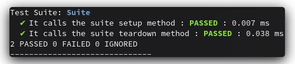

vest
====

Vest is a Test-Driven Development framework for the vala programming language.


Let's write some tests
----------------------

Create a new class derived from `io.github.jorchube.vest.TestSuite`, override the `testCases()` method and define your tests:

```
using io.github.jorchube.vest;

namespace awesome.namespace
{
    class MyTestSuite : TestSuite
    {
        public override void testCases ()
        {
            test("It_passes", () =>
            {
                Assert.true(1 == 1);
            });

            test("It_fails", () =>
            {
                Assert.true(1 == 2);
            });
        }
    }
}
```

What can vest do for you?
-------------------------

### Multiple test suites

Vest lets you define multiple test suites for your project, each one with as many test cases as you want.

### Assertions

Vest comes with an Assert class that provides a basic set of assertion methods for your tests:

- Assert.raises
- Assert.true
- Assert.false
- Assert.equals
- Assert.null
- Assert.notNull

### Mock methods

Vest allows you to mock methods of your test stubs and provides useful methods to check the interactions of the tested code with your stub so that you don't have to write it:

Write your stub class:

```
    public class AStub : AnInterface
    {
        public MethodMock<int, string> aMethodMock;

        public AStub()
        {
            aMethodMock = new MethodMock<int, string>();
        }

        public string TheMethodYouWantToMock(int arg)
        {
            return aMethodMock.call(arg);
        }
    }
```

Use it in your test:

```
    test("Testing a method mock", () =>
    {
        AStub stub = new AStub();

        stub.aMethodMock.returns(1, "one");
        stub.aMethodMock.returns(2, "two");

        Assert.equals("one", stub.aMethod(1));
        Assert.equals("two", stub.aMethod(2));

        Assert.equals(2, stub.aMethodMock.numCalls());
        Assert.true(stub.aMethodMock.calledWith(1));
        Assert.true(stub.aMethodMock.calledWith(2));
        Assert.false(stub.aMethodMock.calledWith(4));
    });
```

You can take a look at the project tests to see all the possibilities.

Okay, but how do I use it?
--------------------------

You can just grab the sources or you can download a precompiled release which contains the files `io.github.jorchube.vest.h`, `io.github.jorchube.vest.vapi` and `libio.github.jorchube.vest.a` and incorporate them into your project.

To execute the tests you will need to define a main method in which initialize Vest, add the test suites and run them:

```
using io.github.jorchube.vest;

namespace awesome.namespace
{
    public static void main()
    {
        Vest.init();

        Vest.addSuite(new MyTestSuite());

        Vest.addSuite(new MyOtherTestSuite());

        Vest.run();
    }
}
```

Vest will execute all the test cases from each test suite and return **0 on success** or **1 on failure**.

Additionally Vest will generate a minimal `test_results.xml` **compatible with JUnit** and write a summary on standard output such as this one:



FAQ
---

### But why?

Some months ago started a project and chose vala. I knew that GLib has some support for writting tests but I really didn't like it that much to be honest. So the only logical step (of course!) in my mind was to develop my own testing tools ~~With blackjack! And h*****s!~~.

### The setup is not that straightforward...

You are **very** welcome to help.

### Why mocking methods instead of classes?

As far as I know, vala does not have full introspection support, so I don't see how I would do it.

#### Why you haven't used GObject-Introspection?

I am not even sure if the question itself makes sense. Anyway, you are **very** welcome to help.

